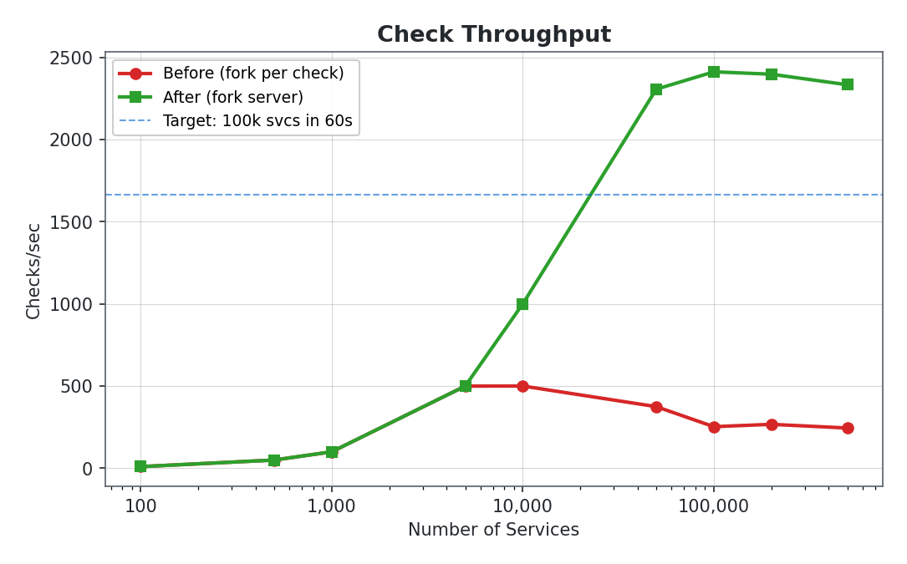
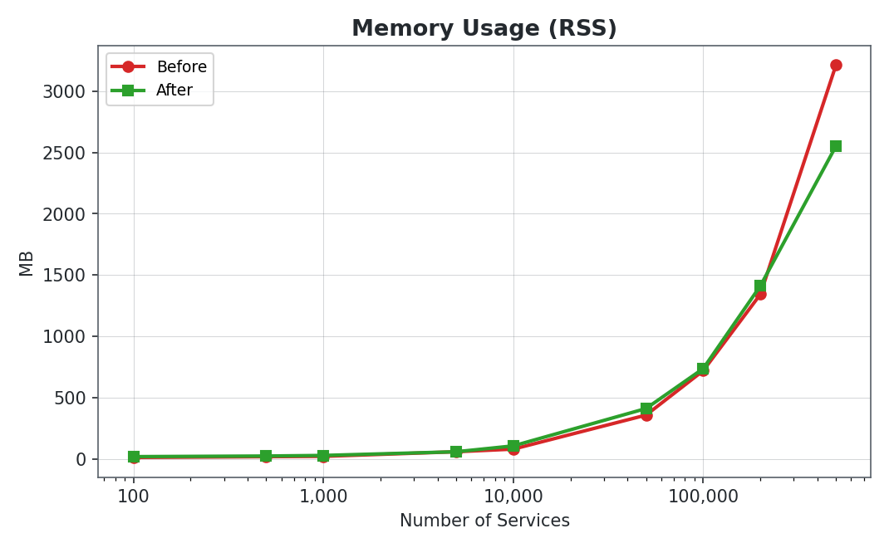
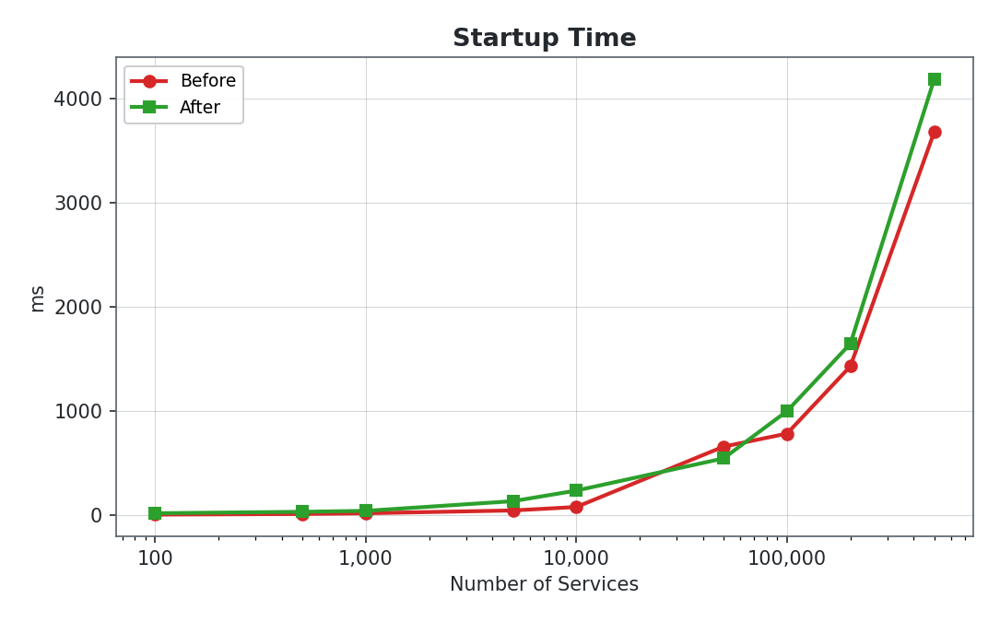
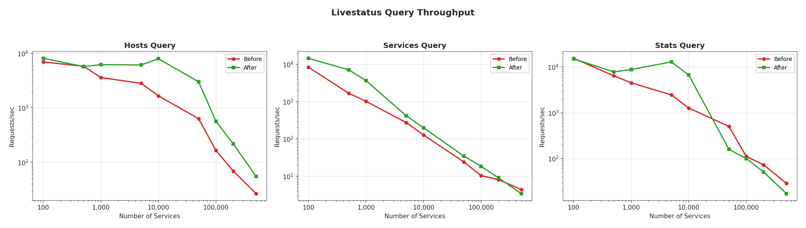
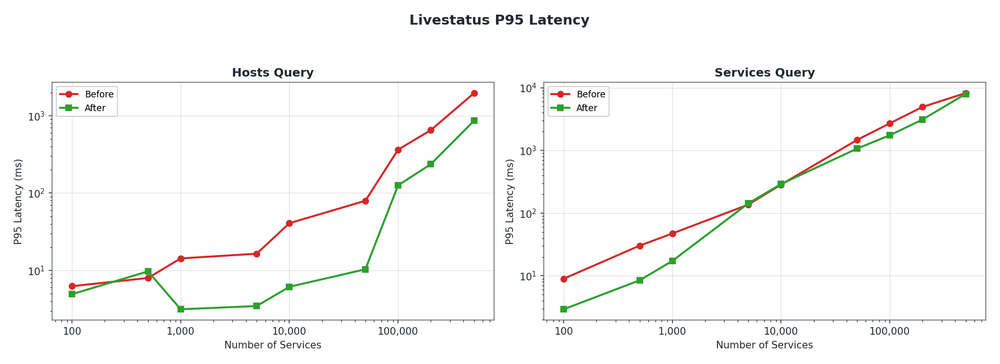
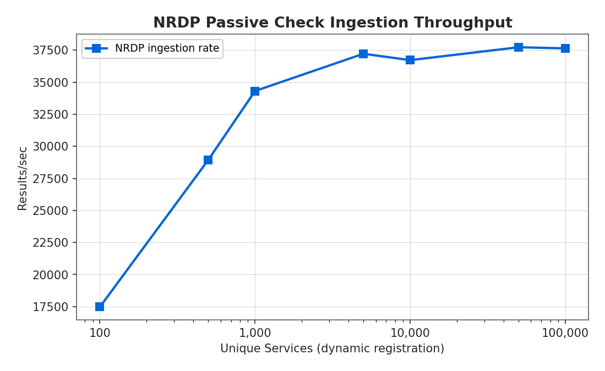
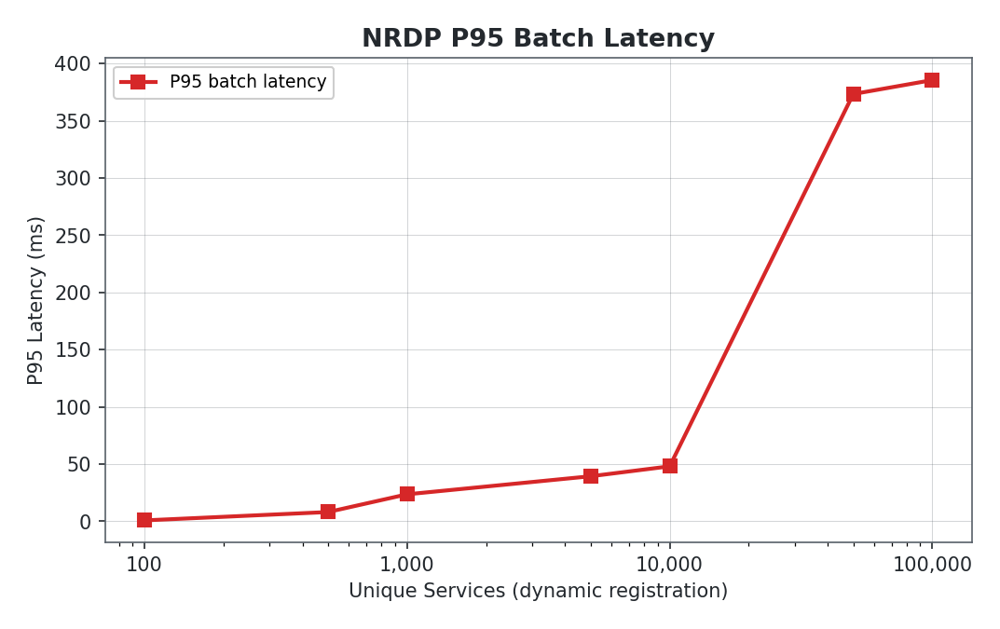
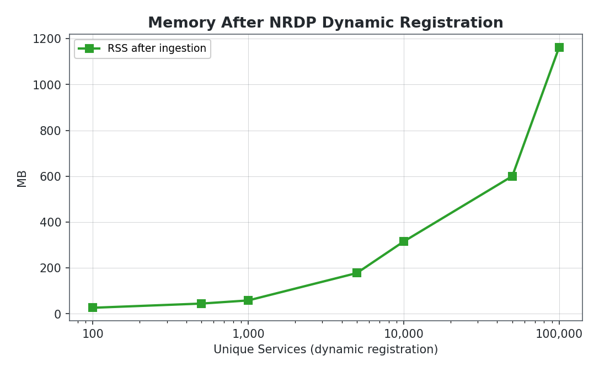

<p align="center">
  
</p>

<h1 align="center">Gogios</h1>

<p align="center">
  <strong>A single-binary Go replacement for Nagios 4.1.1.</strong>
</p>

<p align="center">
  <code>Nagios 4.1.1 Compatible</code> &nbsp;&middot;&nbsp;
  <code>Livestatus / LQL Compatible</code> &nbsp;&middot;&nbsp;
  <code>Thruk Compatible</code> &nbsp;&middot;&nbsp;
  <code>Nagios Plugin Compatible</code> &nbsp;&middot;&nbsp;
  <code>NRDP Relay Built-in</code> &nbsp;&middot;&nbsp;
  <code>Near-Zero Dependencies</code>
</p>

Zero dependencies. No CGIs. No Apache. No NEB modules. No PHP. No Perl. No tears.

Just one binary that reads your existing `nagios.cfg` and does everything the ~200k lines of C did, except it compiles in 2 seconds, doesn't mass-`fork()` itself to death, and ingests **37,000 passive check results per second** — flat from 5k to 100k dynamically-registered services. Your entire fleet updated in under 3 seconds. Nagios can't do that on its best day with a tailwind.

---

## Why

Because it's 2026 and you shouldn't need a LAMP stack to tell you a server is on fire.

Nagios 4.x works. It's battle-tested. But it carries decades of architectural decisions that made sense when Clinton was president. Gogios keeps the config format and ecosystem compatibility (your existing configs, check plugins, and Thruk dashboards all work) while ditching everything else.

**What you get:**
- Drop-in replacement for Nagios 4.1.1 core
- Reads your existing `nagios.cfg`, object configs, templates, resource files, all of it
- Built-in Livestatus server (TCP + Unix socket), Thruk just works
- Built-in NRDP relay endpoint with dynamic host/service auto-registration
- External command pipe, your scripts don't know the difference
- `status.dat` and `retention.dat` compatibility
- One static binary. `scp` it to a box and run it. Done.

**What you don't get:**
- CGIs (this isn't 1998)
- A web UI (use Thruk, it's better than anything you'd build yourself anyway)
- NEB module support (if you need it, you probably need Nagios)
- NDOUtils / database backends
- Emotional baggage

---

## Quick Start

```bash
# Build
go build -o gogios ./cmd/gogios

# Verify your existing Nagios config
./gogios -v /etc/nagios/nagios.cfg

# Verbose verification (lists all parsed objects)
./gogios -v -v /etc/nagios/nagios.cfg

# Run in foreground
./gogios /etc/nagios/nagios.cfg

# Run with verbose check output (see every check result)
./gogios --verbose-checks /etc/nagios/nagios.cfg

# Run with verbose livestatus logging (see every LQL query)
./gogios --verbose-livestatus /etc/nagios/nagios.cfg

# Run as daemon
./gogios -d /etc/nagios/nagios.cfg
```

That's it. If your config passed `nagios -v`, it'll pass here.

---

## CLI Reference

```
gogios [options] <main_config_file>
```

| Flag | Long Form | Description |
|------|-----------|-------------|
| `-v` | `--verify-config` | Pre-flight config check. Stack it (`-v -v`) for verbose object listing. |
| `-s` | `--test-scheduling` | Dump the projected check schedule without actually running anything. |
| `-d` | `--daemon` | Daemonize. You know the drill. |
| | `--verbose-checks` | Log every check result (state, return code, duration, output). |
| | `--verbose-livestatus` | Log every Livestatus query and command. |
| `-T` | `--enable-timing-point` | Timing diagnostics. For when things get weird. |
| `-V` | `--version` | Print version and exit. |
| `-h` | `--help` | Help text for people who don't read READMEs. |

---

## Architecture

```
gogios
├── cmd/gogios/
│   └── main.go                  # Entry point, daemon lifecycle, signal handling
│
└── internal/
    ├── api/
    │   ├── provider.go          # StateProvider + CommandSink interfaces
    │   └── livestatus/          # Full LQL query server
    │       ├── server.go        #   TCP/Unix socket listener, keepalive, fixed16 headers
    │       ├── query.go         #   LQL parser (GET, Columns, Filter, Stats, etc.)
    │       ├── filter.go        #   Filter evaluation engine (=, !=, ~, <, >, And/Or/Negate)
    │       ├── stats.go         #   Aggregation (sum, avg, min, max, std, group-by)
    │       ├── sort.go          #   Multi-column sorting
    │       ├── output.go        #   json, wrapped_json, csv formatters
    │       ├── command.go       #   COMMAND request handler
    │       ├── tables.go        #   Table registry
    │       └── table_*.go       #   14 table implementations
    │
    ├── checker/                 # Check execution engine
    │   ├── executor.go          #   Worker pool (default 256 concurrent) + fork server
    │   ├── forkserver.go        #   Persistent shell workers (avoids fork from large parent)
    │   ├── service.go           #   Service SOFT/HARD state machine
    │   ├── host.go              #   Host SOFT/HARD state machine
    │   ├── flap.go              #   Weighted flap detection (21-entry circular buffer)
    │   └── results.go           #   Plugin output parsing, state recording
    │
    ├── config/                  # Nagios configuration parser
    │   ├── mainconfig.go        #   nagios.cfg directive parser (100+ directives)
    │   ├── loader.go            #   5-step loading pipeline
    │   ├── objects.go           #   Object definition parser (14 object types)
    │   ├── templates.go         #   Template inheritance resolution
    │   ├── expand.go            #   Template expansion + custom variables
    │   ├── validate.go          #   Pre-flight validation
    │   ├── timeperiod.go        #   Time period/range parsing
    │   └── resource.go          #   $USER1$-$USER256$ resource file parser
    │
    ├── dependency/              # Host/service dependency evaluation
    │   └── dependency.go        #   Recursive inherits_parent chains
    │
    ├── downtime/                # Scheduled downtime management
    │   ├── downtime.go          #   Fixed, flexible, and triggered downtimes
    │   └── comments.go          #   Comment system (user, downtime, ack, flap)
    │
    ├── extcmd/                  # External command interface
    │   ├── extcmd.go            #   Named pipe (FIFO) reader + command dispatch
    │   └── fifo_unix.go         #   Unix FIFO creation
    │
    ├── freshness/               # Passive check freshness monitoring
    │   └── freshness.go         #   Staleness = interval * 1.618 + latency
    │
    ├── logging/                 # Log management
    │   └── logging.go           #   File + syslog output, rotation (n/h/d/w/m)
    │
    ├── macros/                  # Nagios macro expansion
    │   └── macros.go            #   100+ macros, $ARG$, $USER$, custom vars, on-demand
    │
    ├── notify/                  # Notification engine
    │   ├── notify.go            #   Viability checks, suppression, contact routing
    │   ├── escalation.go        #   Escalation range matching + contact expansion
    │   └── commands.go          #   Notification command execution
    │
    ├── nrdp/                    # NRDP relay endpoint
    │   ├── server.go            #   HTTP server, bcrypt auth, localhost bypass
    │   ├── payload.go           #   XML/JSON parsing, response formatting (4 content types)
    │   └── dynamic.go           #   Dynamic host/service auto-registration with TTL pruning
    │
    ├── objects/                 # Core data model
    │   ├── types.go             #   Host, Service, Contact, Command, etc. structs
    │   └── store.go             #   In-memory object registry with indexed lookups
    │
    ├── perfdata/                # Performance data processing
    │   └── perfdata.go          #   File output (append/write/pipe) + command execution
    │
    ├── scheduler/               # Event loop + check scheduling
    │   ├── scheduler.go         #   Min-heap event queue, time change detection
    │   ├── checks.go            #   Interleaved initial scheduling, ICD calculation
    │   └── events.go            #   Event types + recurring event registration
    │
    └── status/                  # State persistence
        ├── statusdat.go         #   Atomic status.dat writes
        └── retention.go         #   retention.dat read/write for state recovery
```

**One external dependency** (`golang.org/x/crypto` for bcrypt). Everything else is pure Go stdlib.

---

## What's Actually Implemented

This isn't a toy. Here's the full feature matrix:

### Configuration Parsing

| Feature | Status |
|---------|--------|
| `nagios.cfg` main config (100+ directives) | Done |
| `cfg_file` / `cfg_dir` / `include_file` / `include_dir` | Done |
| `resource.cfg` (`$USER1$` through `$USER256$`) | Done |
| 14 object types (host, service, command, contact, contactgroup, hostgroup, servicegroup, timeperiod, hostdependency, servicedependency, hostescalation, serviceescalation) | Done |
| Template inheritance (`use` directive, `register 0`) | Done |
| Custom variables (`_CUSTOM_VAR`) | Done |
| Time period parsing (weekday ranges, calendar dates, exceptions) | Done |
| Pre-flight validation | Done |

### Check Engine

| Feature | Status |
|---------|--------|
| Bounded concurrent check execution (256-worker pool + fork server) | Done |
| Plugin execution via persistent `/bin/sh` workers (fallback to direct fork+exec) | Done |
| Configurable timeouts (returns CRITICAL on timeout) | Done |
| Service SOFT/HARD state machine (full Nagios state transition logic) | Done |
| Host SOFT/HARD state machine | Done |
| `max_check_attempts` (including immediate HARD at `max_check_attempts=1`) | Done |
| Interleaved check scheduling with configurable ICD | Done |
| Active and passive checks | Done |
| Volatile services | Done |
| Orphaned check detection | Done |
| Freshness checking (threshold = `interval * 1.618 + latency`) | Done |
| Flap detection (21-entry weighted circular buffer, configurable thresholds) | Done |

### Notifications

| Feature | Status |
|---------|--------|
| PROBLEM / RECOVERY / ACKNOWLEDGEMENT / FLAPPING / DOWNTIME notifications | Done |
| Notification viability checks (enabled, in period, not suppressed) | Done |
| Contact routing with notification options filtering | Done |
| Notification escalations (first/last notification ranges, escalation periods) | Done |
| Host/service dependencies (notification + execution, `inherits_parent`) | Done |
| Acknowledgements (normal + sticky, notification suppression) | Done |
| Notification commands with full macro expansion | Done |

### Downtime & Comments

| Feature | Status |
|---------|--------|
| Fixed downtimes | Done |
| Flexible downtimes (duration-based, activates on state change) | Done |
| Triggered downtimes (`trigger_id` chaining) | Done |
| Downtime start/end/cancel notifications | Done |
| Comments (user, downtime, acknowledgement, flapping) | Done |
| Persistent and non-persistent comments | Done |

### NRDP Relay

| Feature | Status |
|---------|--------|
| HTTP endpoint (`POST /nrdp/`) with configurable listen address and path | Done |
| 4 content types: XML form, JSON form, raw XML, raw JSON | Done |
| bcrypt token authentication (cost 14) | Done |
| Localhost bypass (`127.0.0.1` / `::1` skip auth) | Done |
| Response format mirrors request format | Done |
| Request ID for log correlation (3-letter codes) | Done |
| Results injected into standard passive check pipeline | Done |
| Dynamic host auto-creation on first NRDP submission | Done |
| Dynamic service auto-creation on first NRDP submission | Done |
| TTL-based pruning of stale dynamic objects (configurable) | Done |
| Static config objects protected from pruning | Done |
| Optional TLS (cert + key) | Done |
| Zero overhead when disabled (no goroutines, no socket) | Done |

### External Commands

Full command pipe interface. Reads `[timestamp] COMMAND_NAME;arg1;arg2;...` from the named pipe.

**System controls:**
`ENABLE_NOTIFICATIONS` `DISABLE_NOTIFICATIONS` `START_EXECUTING_SVC_CHECKS` `STOP_EXECUTING_SVC_CHECKS` `START_EXECUTING_HOST_CHECKS` `STOP_EXECUTING_HOST_CHECKS` `ENABLE_FLAP_DETECTION` `DISABLE_FLAP_DETECTION` `ENABLE_EVENT_HANDLERS` `DISABLE_EVENT_HANDLERS` `SHUTDOWN_PROGRAM`

**Check results:**
`PROCESS_SERVICE_CHECK_RESULT` `PROCESS_HOST_CHECK_RESULT`

**Scheduling:**
`SCHEDULE_FORCED_SVC_CHECK` `SCHEDULE_FORCED_HOST_CHECK`

**Acknowledgements:**
`ACKNOWLEDGE_SVC_PROBLEM` `ACKNOWLEDGE_HOST_PROBLEM` `REMOVE_SVC_ACKNOWLEDGEMENT` `REMOVE_HOST_ACKNOWLEDGEMENT`

**Downtime:**
`SCHEDULE_HOST_DOWNTIME` `SCHEDULE_SVC_DOWNTIME` `DEL_HOST_DOWNTIME` `DEL_SVC_DOWNTIME`

**Per-object toggles:**
`ENABLE_HOST_NOTIFICATIONS` `DISABLE_HOST_NOTIFICATIONS` `ENABLE_SVC_NOTIFICATIONS` `DISABLE_SVC_NOTIFICATIONS` `ENABLE_HOST_CHECK` `DISABLE_HOST_CHECK` `ENABLE_SVC_CHECK` `DISABLE_SVC_CHECK`

### Macro System

Full Nagios macro expansion across check commands, notification commands, event handlers, and perfdata templates:

- **Host macros:** `$HOSTNAME$` `$HOSTADDRESS$` `$HOSTALIAS$` `$HOSTSTATE$` `$HOSTSTATEID$` `$HOSTOUTPUT$` `$HOSTPERFDATA$` and ~30 more
- **Service macros:** `$SERVICEDESC$` `$SERVICESTATE$` `$SERVICESTATEID$` `$SERVICEOUTPUT$` `$SERVICEPERFDATA$` and ~30 more
- **Contact macros:** `$CONTACTNAME$` `$CONTACTEMAIL$` `$CONTACTPAGER$` `$CONTACTADDRESS1$` through `$CONTACTADDRESS6$`
- **Argument macros:** `$ARG1$` through `$ARG32$`
- **User macros:** `$USER1$` through `$USER256$`
- **Custom variables:** `$_HOSTVARNAME$` `$_SERVICEVARNAME$` `$_CONTACTVARNAME$`
- **On-demand macros:** `$HOSTSTATE:somehostname$` `$SERVICESTATE:hostname:servicedesc$`

### State Persistence

| Feature | Status |
|---------|--------|
| `status.dat` atomic writes (temp + rename) | Done |
| `retention.dat` save on shutdown | Done |
| `retention.dat` restore on startup | Done |
| Configurable update intervals | Done |
| Preserves: states, downtimes, comments, notification counters, problem IDs | Done |

### Logging & Performance Data

| Feature | Status |
|---------|--------|
| Log file with `[timestamp] message` format | Done |
| Syslog output (LOG_USER) | Done |
| Log rotation: none, hourly, daily, weekly, monthly | Done |
| Conditional logging (notifications, retries, event handlers, external commands, passive checks) | Done |
| Verbose check result logging (`--verbose-checks`) | Done |
| Verbose Livestatus query logging (`--verbose-livestatus`) | Done |
| Performance data file output (append/write/pipe modes) | Done |
| Performance data commands with macro expansion | Done |

---

## Livestatus

The built-in Livestatus server speaks the full LQL protocol. Compatible with **Thruk 3.26** out of the box. No adapters, no proxies, no prayers.

### Configuration

```ini
# In your nagios.cfg:

# TCP listener (for Thruk, scripts, etc.)
livestatus_tcp=0.0.0.0:6557

# Unix socket (traditional)
query_socket=/var/lib/nagios/rw/live
```

Both can run simultaneously. KeepAlive connections are supported.

### Tables

| Table | Description |
|-------|-------------|
| `hosts` | All host objects with full state |
| `services` | All service objects with full state |
| `hostgroups` | Host group definitions and membership |
| `servicegroups` | Service group definitions and membership |
| `contacts` | Contact objects |
| `contactgroups` | Contact group definitions and membership |
| `commands` | Command definitions |
| `timeperiods` | Time period definitions with day/time ranges |
| `comments` | Active comments (user, downtime, ack, flap) |
| `downtimes` | Scheduled downtimes |
| `status` | Global program status (PID, start time, feature flags) |
| `columns` | Meta-table: describes all available columns across all tables |
| `log` | Parsed log entries from `nagios.log` |

### Query Language

Full LQL support including the stuff people actually use:

```
GET services
Columns: host_name description state plugin_output
Filter: state != 0
Filter: host_name ~ ^web
And: 2
Sort: state desc
Limit: 50
OutputFormat: json
```

**Filter operators:** `=` `!=` `<` `>` `<=` `>=` `~` (regex) `!~` (not regex)

**Combinators:** `And: N` `Or: N` `Negate:`

**Stats queries:**
```
GET services
Stats: state = 0
Stats: state = 1
Stats: state = 2
Stats: state = 3
```

**Aggregation functions:** `sum` `avg` `min` `max` `std`

**Stats combinators:** `StatsAnd: N` `StatsOr: N`

**Output formats:** `json` `wrapped_json` `csv`

**Response headers:** `fixed16` (standard Livestatus header format)

**External commands via Livestatus:**
```
COMMAND [1234567890] SCHEDULE_FORCED_SVC_CHECK;web-01;HTTP;1234567890
```

---

## NRDP Relay

Gogios includes a built-in NRDP (Nagios Remote Data Processor) endpoint. Any tool that speaks NRDP — [nrdc](https://github.com/Captain-Kiwi/nrdc), Nagios NRDP clients, custom scripts — can push passive check results over HTTP without touching the command pipe.

### Configuration

```ini
# In your nagios.cfg:

# Enable the NRDP HTTP endpoint (leave empty or omit to disable)
nrdp_listen=0.0.0.0:5668
nrdp_path=/nrdp/

# bcrypt hash of your auth token (cost 14 recommended)
# Generate with: htpasswd -nbBC 14 "" "your-token" | cut -d: -f2
nrdp_token_hash=$2b$14$...

# Optional TLS
#nrdp_ssl_cert=/path/to/cert.pem
#nrdp_ssl_key=/path/to/key.pem
```

If `nrdp_listen` is not set, NRDP is completely disabled — zero overhead, no goroutines, no listening socket.

### Authentication

- **Token auth:** Clients send a `token` field (form param or query param). Gogios compares it against the bcrypt hash in `nrdp_token_hash`.
- **Localhost bypass:** Requests from `127.0.0.1` or `::1` skip authentication.
- **Empty token or empty hash:** Always rejected (no open relay by default).

### Accepted Formats

| Format | Content-Type | Payload Field |
|--------|-------------|--------------|
| XML form (native NRDP) | `application/x-www-form-urlencoded` | `XMLDATA` |
| JSON form | `application/x-www-form-urlencoded` | `JSONDATA` |
| Raw XML | `text/xml` or `application/xml` | request body |
| Raw JSON | `application/json` | request body |

Response format mirrors the request format (XML in → XML out, JSON in → JSON out).

### How It Works

Results received via NRDP are injected into the same pipeline as `PROCESS_SERVICE_CHECK_RESULT` / `PROCESS_HOST_CHECK_RESULT` external commands. The full state machine applies: SOFT/HARD transitions, notifications, flap detection, downtimes — all of it.

### Dynamic Host/Service Auto-Registration

When enabled, Gogios automatically creates host and service objects on the fly when it receives NRDP results for objects that don't exist in the configuration. This is useful for agents like nrdc that submit checks for hosts Gogios hasn't seen before.

```ini
# Enable dynamic registration
nrdp_dynamic_enabled=1

# How long before a dynamic object is pruned if no new checks arrive (seconds, default 86400 = 24h)
nrdp_dynamic_ttl=86400

# How often the pruner runs (seconds, default 600 = 10 minutes)
nrdp_dynamic_prune_interval=600
```

**Fast add, slow delete:** Dynamic objects are created instantly on first submission. They're only removed after `nrdp_dynamic_ttl` seconds of silence. Objects defined in your configuration files are never pruned.

Dynamic objects are created with passive checks enabled and active checks disabled (no check command). They appear in `status.dat`, Livestatus, and Thruk like any other object.

### Example: Submitting a Check Result

```bash
# XML form POST (native NRDP format, same as nrdc uses)
curl -s -X POST "http://localhost:5668/nrdp/" \
  -d "token=your-secret-token&cmd=submitcheck" \
  --data-urlencode "XMLDATA=<?xml version='1.0'?>
<checkresults>
  <checkresult type='service' checktype='1'>
    <hostname>web-01</hostname>
    <servicename>HTTP</servicename>
    <state>0</state>
    <output>HTTP OK: 200 OK - 0.003s response time</output>
  </checkresult>
</checkresults>"

# JSON POST
curl -s -X POST "http://localhost:5668/nrdp/" \
  -H "Content-Type: application/json" \
  -d '{
    "token": "your-secret-token",
    "checkresults": [{
      "hostname": "web-01",
      "servicename": "HTTP",
      "state": 0,
      "output": "HTTP OK: 200 OK - 0.003s response time"
    }]
  }'
```

### Log Output

```
[1707533401] NRDP relay listening on 0.0.0.0:5668/nrdp/
[1707533401] NRDP dynamic host/service registration enabled (TTL=86400s, prune=600s)
[1707534554] NRDP [AOA] Processing 3 Results from 192.168.1.50:45678 (xmlform)
[1707534554] SERVICE ALERT: web-01;HTTP;OK;HARD;1;HTTP OK: 200 OK - 0.003s response time
```

Each NRDP request gets a 3-letter request ID (e.g., `[AOA]`) for log correlation.

---

## Configuration Directives

Gogios supports the full `nagios.cfg` directive set. If you've written a `nagios.cfg` before, it works the same way.

### File Paths
`cfg_file` `cfg_dir` `resource_file` `log_file` `status_file` `state_retention_file` `object_cache_file` `temp_file` `temp_path` `check_result_path` `command_file` `lock_file` `log_archive_path` `debug_file` `host_perfdata_file` `service_perfdata_file`

### Livestatus (Gogios extension)
`query_socket` `livestatus_tcp`

### NRDP Relay (Gogios extension)
`nrdp_listen` `nrdp_path` `nrdp_token_hash` `nrdp_dynamic_enabled` `nrdp_dynamic_ttl` `nrdp_dynamic_prune_interval` `nrdp_ssl_cert` `nrdp_ssl_key`

### Logging
`use_syslog` `log_notifications` `log_service_retries` `log_host_retries` `log_event_handlers` `log_external_commands` `log_passive_checks` `log_initial_states` `log_current_states` `log_rotation_method` `debug_level` `debug_verbosity`

### Check Execution
`service_check_timeout` `host_check_timeout` `event_handler_timeout` `notification_timeout` `max_concurrent_checks` `execute_service_checks` `execute_host_checks` `accept_passive_service_checks` `accept_passive_host_checks`

### Scheduling
`interval_length` `service_inter_check_delay_method` `host_inter_check_delay_method` `service_interleave_factor` `max_service_check_spread` `max_host_check_spread` `check_result_reaper_frequency` `auto_reschedule_checks`

### State Management
`retain_state_information` `retention_update_interval` `use_retained_program_state` `status_update_interval` `additional_freshness_latency`

### Feature Toggles
`enable_notifications` `enable_event_handlers` `enable_flap_detection` `process_performance_data` `obsess_over_services` `obsess_over_hosts` `check_service_freshness` `check_host_freshness` `check_external_commands`

### Flap Detection
`low_service_flap_threshold` `high_service_flap_threshold` `low_host_flap_threshold` `high_host_flap_threshold`

### Global Handlers
`global_host_event_handler` `global_service_event_handler` `host_perfdata_command` `service_perfdata_command`

---

## Runtime Internals

For the curious (or the masochistic), here's how it works under the hood.

### Startup Sequence

1. Parse CLI arguments
2. Load and validate configuration (5-step pipeline: main config, resource files, object configs, template resolution, expansion/registration/wiring)
3. Initialize subsystems (logger, check executor, downtime/comment managers, notification engine)
4. Restore state from `retention.dat` (if `retain_state_information=1`)
5. Register external command handlers
6. Start Livestatus server(s)
7. Start NRDP relay (if configured)
8. Schedule initial checks with smart interleaving
9. Write initial `status.dat`
10. Enter main event loop
11. Handle `SIGTERM`/`SIGINT` (clean shutdown) and `SIGHUP` (reserved)

### Event Loop

The scheduler runs a min-heap priority queue. No polling, no busy-waiting:

```
loop:
    next_event = peek queue
    select:
        case <-stop:           return
        case result <-results: process check result, reschedule
        case cmd <-commands:   dispatch external command
        case <-timer(next):    fire ready events
```

Events include: `HostCheck` `ServiceCheck` `CheckReaper` `OrphanCheck` `ServiceFreshness` `HostFreshness` `StatusSave` `RetentionSave` `LogRotation`

### State Machine

Both hosts and services implement the full Nagios SOFT/HARD state machine:

```
OK ──[fail]──-> SOFT(1) ──[fail]──-> SOFT(2) ──[...]──-> HARD ──[recover]──-> OK
                  │                    │                  │
                  └──[recover]──-> OK   └──[recover]──-> OK │
                  (no notification)    (no notification)   └──-> PROBLEM notification
                                                                  │
                                                           OK ←───┘ RECOVERY notification
```

Special cases handled:
- `max_check_attempts=1`: immediate HARD on first failure
- Host DOWN: dependent services forced to HARD (notifications suppressed)
- Flapping: notifications suppressed until flapping stops
- Acknowledgement: suppresses repeat PROBLEM notifications
- Scheduled downtime: suppresses all notifications

### Flap Detection

21-entry weighted circular buffer. Recent state changes are weighted up to 1.25x, older ones down to 0.75x. When the weighted percent exceeds `high_flap_threshold` (default 50%), the object starts flapping. It stops when it drops below `low_flap_threshold` (default 25%).

Yes, 1.618 shows up in the freshness calculation. The golden ratio. Because if you're going to pick a magic number, pick a *classy* magic number.

---

## Log Output

All log lines follow the standard Nagios format: `[unix_timestamp] MESSAGE`. Fully compatible with log parsers, Thruk's log viewer, and whatever janky `grep` pipeline you've got in production. No judgment.

### Startup

```
[1707533400] Gogios 1.0.0 starting... (PID=48721)
[1707533400] Local time is Mon Feb 10 15:30:00 UTC 2025
[1707533400] LOG VERSION: 2.0
[1707533400] Finished loading configuration with 42 hosts, 156 services
[1707533401] Scheduling initial checks...
[1707533401] Scheduled 198 events in queue
[1707533401] Livestatus API listening on tcp:0.0.0.0:6557
[1707533401] Livestatus API listening on unix:/var/lib/nagios/rw/live
[1707533401] External command processor started on /var/lib/nagios/rw/nagios.cmd
[1707533402] Gogios ready. Entering main event loop.
```

### Initial State

```
[1707533401] INITIAL HOST STATE: web-01;UP;HARD;1;PING OK - Packet loss = 0%, RTA = 0.52 ms
[1707533401] INITIAL SERVICE STATE: web-01;HTTP;OK;HARD;1;HTTP OK: HTTP/1.1 200 OK - 1234 bytes in 0.003 second response time
[1707533401] INITIAL SERVICE STATE: db-master;PostgreSQL;WARNING;HARD;1;PGSQL WARNING - 847 connections (threshold 800)
```

### Host and Service Alerts

The bread and butter. SOFT states are retries, HARD states mean it's real.

```
[1707534100] SERVICE ALERT: web-01;HTTP;CRITICAL;SOFT;1;Connection refused
[1707534160] SERVICE ALERT: web-01;HTTP;CRITICAL;SOFT;2;Connection refused
[1707534220] SERVICE ALERT: web-01;HTTP;CRITICAL;HARD;3;Connection refused
[1707534580] SERVICE ALERT: web-01;HTTP;OK;HARD;1;HTTP OK: HTTP/1.1 200 OK - 0.003s response time

[1707535000] HOST ALERT: db-master;DOWN;SOFT;1;PING CRITICAL - Packet loss = 100%
[1707535060] HOST ALERT: db-master;DOWN;HARD;3;PING CRITICAL - Packet loss = 100%
[1707535300] HOST ALERT: db-master;UP;HARD;1;PING OK - Packet loss = 0%, RTA = 0.89 ms
```

### Notifications

```
[1707534220] SERVICE NOTIFICATION: admin;web-01;HTTP;CRITICAL;notify-service-by-email;Connection refused
[1707534221] SERVICE NOTIFICATION: oncall-engineer;web-01;HTTP;CRITICAL;notify-service-by-slack;Connection refused
[1707534580] SERVICE NOTIFICATION: admin;web-01;HTTP;RECOVERY;notify-service-by-email;HTTP OK: HTTP/1.1 200 OK - 0.003s response time

[1707535060] HOST NOTIFICATION: admin;db-master;DOWN;notify-host-by-email;PING CRITICAL - Packet loss = 100%
[1707535300] HOST NOTIFICATION: admin;db-master;RECOVERY;notify-host-by-email;PING OK - Packet loss = 0%, RTA = 0.89 ms
```

### Downtime

```
[1707540000] HOST DOWNTIME ALERT: web-01;STARTED; web-01 has entered a period of scheduled downtime
[1707543600] HOST DOWNTIME ALERT: web-01;STOPPED; web-01 has exited from a period of scheduled downtime

[1707540000] SERVICE DOWNTIME ALERT: db-master;PostgreSQL;STARTED; PostgreSQL on db-master has entered a period of scheduled downtime
[1707543600] SERVICE DOWNTIME ALERT: db-master;PostgreSQL;CANCELLED; PostgreSQL on db-master has exited from a period of scheduled downtime
```

### External Commands

```
[1707534800] EXTERNAL COMMAND: SCHEDULE_FORCED_SVC_CHECK;web-01;HTTP;1707534800
[1707534900] EXTERNAL COMMAND: ACKNOWLEDGE_SVC_PROBLEM;db-master;PostgreSQL
[1707535000] EXTERNAL COMMAND: SCHEDULE_HOST_DOWNTIME;web-01
[1707535100] EXTERNAL COMMAND: DISABLE_NOTIFICATIONS
[1707535200] EXTERNAL COMMAND: ENABLE_NOTIFICATIONS
```

### Passive Checks

```
[1707536000] PASSIVE SERVICE CHECK: app-01;Backup Status;0;Backup completed successfully in 45 minutes
[1707536001] PASSIVE SERVICE CHECK: db-master;DB Backup;2;CRITICAL: Backup failed - disk full
[1707536002] PASSIVE HOST CHECK: remote-node;0;Host is alive
```

### Event Handlers

```
[1707534220] SERVICE EVENT HANDLER: web-01;HTTP;CRITICAL;HARD;3;restart-apache
[1707534580] SERVICE EVENT HANDLER: web-01;HTTP;OK;HARD;1;restart-apache
[1707535060] GLOBAL HOST EVENT HANDLER: db-master;DOWN;HARD;3;global-host-handler
```

### Log Rotation

```
[1707550800] LOG ROTATION: /var/log/nagios/archives/nagios-02-10-2025-00.log
[1707550800] LOG VERSION: 2.0
```

### Shutdown

```
[1707599999] Caught SIGTERM, shutting down...
[1707600000] Retention data saved.
[1707600000] Successfully shutdown... (PID=48721)
```

### Verbose Mode

Two independent verbosity flags can be combined. Neither writes anything by default — you opt in to what you want to see.

**`--verbose-checks`** — Logs every check result, not just state changes. Useful for debugging check commands or watching execution flow:

```
[1707534100] CHECK RESULT: web-01;HTTP;OK;0;0.003s;HTTP OK: HTTP/1.1 200 OK - 1234 bytes in 0.003 second response time
[1707534101] CHECK RESULT: db-master;PostgreSQL;WARNING;1;0.045s;PGSQL WARNING - 847 connections (threshold 800)
[1707534102] CHECK RESULT: router;UP;0;0.012s;PING OK - Packet loss = 0%
```

**`--verbose-livestatus`** — Logs every Livestatus query and command arriving on the socket. Useful for debugging Thruk integration:

```
[1707534200] LIVESTATUS: GET services (Columns: 12) (Filters: 2) from 127.0.0.1:54321
[1707534201] LIVESTATUS: GET hosts (Columns: 8) (Filters: 0) from /var/lib/nagios/rw/live
[1707534202] LIVESTATUS: COMMAND [1707534202] SCHEDULE_FORCED_SVC_CHECK;web-01;HTTP;1707534202 from 127.0.0.1:54322
```

Both can be used together:
```bash
./gogios --verbose-checks --verbose-livestatus /etc/nagios/nagios.cfg
```

---

## Performance

Gogios was benchmarked from 100 to 500,000 services on a single machine (Apple M4, macOS). Check plugins used `/usr/bin/true` (zero-cost plugin) to isolate scheduling and execution overhead from plugin runtime.

### Check Throughput

The fork server architecture keeps persistent `/bin/sh` processes alive per worker, so child commands fork from a ~3MB shell instead of the ~700MB Go parent. This eliminates the kernel page-table copy cost that made `fork()` scale inversely with RSS.

<p align="center">
  
</p>

**Result:** Flat ~2,400 checks/sec from 10k to 500k services. The dashed line marks the rate needed to check 100k services within a 60-second interval.

### Memory & Startup

<p align="center">
  
  
</p>

Memory scales linearly with object count. Startup (config parse + schedule build) stays under 5 seconds even at 500k services.

### Livestatus / LQL

<p align="center">
  
</p>

<p align="center">
  
</p>

LQL queries use snapshot-based reads (lock held only during slice copy), pre-compiled regex filters, and single-pass stats evaluation. Hosts queries stay above 50 rps even at 500k services. Stats queries (the kind Thruk fires constantly) hold up well across the range.

### Raw Numbers

| Services | Startup | RSS | Checks/sec | LQL Hosts rps | LQL Services rps | LQL Stats rps |
|----------|---------|-----|------------|---------------|-------------------|---------------|
| 100 | 17ms | 19MB | 10 | 8,116 | 14,479 | 14,974 |
| 1,000 | 40ms | 29MB | 100 | 6,200 | 3,648 | 8,753 |
| 10,000 | 235ms | 107MB | 1,000 | 7,958 | 199 | 6,657 |
| 50,000 | 544ms | 411MB | 2,307 | 2,995 | 35 | 159 |
| 100,000 | 998ms | 737MB | 2,413 | 562 | 18 | 100 |
| 200,000 | 1.6s | 1.4GB | 2,398 | 217 | 9 | 51 |
| 500,000 | 4.2s | 2.6GB | 2,334 | 54 | 3 | 17 |

### Running the Benchmark

```bash
# Build the binary
go build -o gogios-bench ./cmd/gogios

# Run the full suite (100 → 500k services, takes ~20 minutes)
go run bench/scale/scale.go -binary ./gogios-bench -out bench/results.csv

# Run a single scenario (e.g. 100k services only)
go run bench/scale/scale.go -binary ./gogios-bench -out bench/results.csv -only 100000

# Custom check command (default: /usr/bin/true)
go run bench/scale/scale.go -binary ./gogios-bench -check "/usr/lib/nagios/plugins/check_ping -H 127.0.0.1 -w 100,20% -c 500,60%"

# Generate README graphs from results
python3 bench/plot_readme.py
```

The benchmark generates synthetic Nagios configs, starts gogios, measures check throughput via Livestatus `Stats: last_check >= <timestamp>` over a 10-second window, then hammers the LQL endpoint with concurrent queries.

---

## Passive / NRDP Performance

NRDP passive check ingestion was benchmarked from 100 to 100,000 dynamically-created services. All hosts and services were auto-registered on the fly (no pre-configured objects). The benchmark submits batched XML form POSTs from concurrent HTTP clients via localhost (auth bypass).

### Ingestion Throughput

<p align="center">
  
</p>

**Result:** Sustained ~37,000 passive results/sec from 5k to 100k dynamic services. At this rate, 100k services can be fully updated in under 3 seconds.

### Batch Latency & Memory

<p align="center">
  
  
</p>

P95 batch latency stays under 50ms for batches of 100 results up to 10k services. At 50k+ services with batch sizes of 500, latency increases to ~380ms per batch — still well within acceptable range since each batch carries 500 results.

Memory scales linearly with the number of dynamically-registered objects, matching the active check memory profile.

### Raw Numbers

| Unique Services | Total Submitted | Batch Size | Concurrency | Results/sec | P95 Batch (ms) | RSS |
|----------------|----------------|------------|-------------|-------------|----------------|-----|
| 100 | 1,000 | 10 | 1 | 17,468 | 0.8 | 26MB |
| 500 | 5,000 | 50 | 2 | 28,944 | 8.1 | 45MB |
| 1,000 | 10,000 | 100 | 4 | 34,314 | 23.6 | 58MB |
| 5,000 | 49,600 | 100 | 8 | 37,221 | 39.3 | 178MB |
| 10,000 | 100,000 | 100 | 10 | 36,724 | 48.0 | 315MB |
| 50,000 | 200,000 | 500 | 20 | 37,729 | 373.3 | 600MB |
| 100,000 | 400,000 | 500 | 20 | 37,643 | 385.5 | 1.2GB |

### Running the NRDP Benchmark

```bash
# Build the binary
go build -o gogios-bench ./cmd/gogios

# Run the full suite (100 → 100k services)
go run bench/nrdp/bench.go -binary ./gogios-bench -out bench/nrdp_results.csv

# Run a single scenario (e.g. 10k services only)
go run bench/nrdp/bench.go -binary ./gogios-bench -only 10000

# Generate README graphs from results
python3 bench/plot_nrdp.py
```

The benchmark starts gogios with NRDP enabled (dynamic registration, no pre-configured objects), then sends batched XML form POSTs from concurrent HTTP clients. All hosts and services are auto-created via the dynamic registration system.

---

## Scaling Guidelines

The check throughput ceiling (~2,400 checks/sec with `/usr/bin/true`) is the theoretical maximum — real plugins take time to execute, so the practical limit depends on your check command runtimes.

### Active Check Capacity

With a 1-minute check interval (`check_interval=1`, `interval_length=60`):

| Plugin Runtime | Max Active Services | Example Setup |
|---------------|-------------------|---------------|
| ~0ms (trivial) | ~140,000 | 2,400/sec × 60s. CPU-bound limit. |
| ~10ms (fast) | ~15,000 | `check_ping` to localhost, simple scripts |
| ~100ms (typical) | ~2,500 | `check_http`, `check_mysql`, LAN checks |
| ~500ms (slow) | ~500 | Remote checks over WAN, DNS-heavy plugins |
| ~2s (very slow) | ~125 | Complex SNMP walks, slow API calls |

The 256 default worker pool means up to 256 checks run simultaneously. If your average plugin takes 100ms, you get `256 / 0.1 = 2,560` checks/sec throughput. The table above uses `256 / plugin_seconds × 60` to estimate capacity.

### Rule of Thumb

- **< 5,000 services**: Active checks work great. Default config, no tuning needed.
- **5,000 – 50,000 services**: Active checks still work. Consider `max_concurrent_checks=512` and faster check intervals. Keep plugin runtimes under 200ms.
- **50,000 – 100,000 services**: Feasible with active checks if plugins are fast (< 50ms average). Use NRPE or local agents to minimize network latency in check plugins. Bump `max_concurrent_checks` to match your CPU cores × plugins-per-core capacity.
- **100,000+ services**: Shift to passive checks (NSCA, check_mk, NRPE push mode). Active polling at this scale requires extremely fast plugins or distributed check execution. The scheduler and LQL engine handle the object count fine — it's plugin execution time that becomes the bottleneck.

### When to Go Passive

If `(number_of_services × average_plugin_runtime) / 60 > max_concurrent_checks`, you'll fall behind. At that point:

1. Deploy check agents (nrdc, NRPE, check_mk agent, node_exporter + adapter) on monitored hosts
2. Have them push results via NRDP, `PROCESS_SERVICE_CHECK_RESULT` through the command pipe, or Livestatus
3. Gogios processes passive results through the same state machine — SOFT/HARD transitions, notifications, downtimes all work identically
4. With `nrdp_dynamic_enabled=1`, new hosts and services are auto-created on first submission — no config file changes needed

---

## Building

```bash
# That's it. No Makefile. No build script. No Docker. Just Go.
go build -o gogios ./cmd/gogios
```

Requires **Go 1.25.6+**. Only external dependency is `golang.org/x/crypto` (bcrypt for NRDP token auth).

---

## Testing

```bash
# Run the full test suite
go test ./...

# Verbose output (see every test name and result)
go test ./... -v

# Run tests for a specific package
go test ./internal/api/livestatus/...
go test ./internal/config/...

# Run a specific test by name
go test ./internal/extcmd -run TestParse

# Race detector (slower, but catches concurrency bugs)
go test -race ./...

# With coverage report
go test -coverprofile=coverage.out ./...
go tool cover -html=coverage.out    # open in browser
```

The test suite covers config parsing, object resolution, the Livestatus/LQL engine (query parsing, filters, stats, sorting, output formatting), external command dispatch, macro expansion, perfdata processing, scheduling, flap detection, dependency evaluation, freshness checking, downtime handling, notifications, status file generation, and the NRDP relay (payload parsing, auth, dynamic registration, TTL pruning). All tests are pure unit tests with no network I/O, no disk I/O (outside of `t.TempDir()`), and no external dependencies.

---

## Migration from Nagios

1. Build Gogios
2. Point it at your existing `nagios.cfg`
3. Add `livestatus_tcp=0.0.0.0:6557` to your config (or `query_socket` for Unix socket)
3b. (Optional) Add `nrdp_listen=0.0.0.0:5668` + `nrdp_token_hash=...` for NRDP passive check ingestion
4. Run `./gogios -v /etc/nagios/nagios.cfg` to validate
5. Stop Nagios
6. Start Gogios
7. There is no step 7

Your check plugins, notification scripts, event handlers, and Thruk dashboards all work unchanged. Your configs are the same files. The command pipe is the same pipe. `status.dat` lands in the same place.

If something doesn't work, it's a bug. File it.

---

## License

[MIT](LICENSE)
